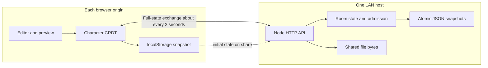

# DocDoc Technical Specification

This document describes the implemented DocDoc Offline MVP as a system: its domain, storage boundaries, synchronization protocol, trust model, and operational limits. It complements the user instructions in [the README](../readme.md) and the original [application plan](application-plan.md). “Current” statements refer to this repository, not a promised future design.

## 1. Product domain

DocDoc is a local-first text workspace with optional LAN collaboration. A person can create and edit Markdown-oriented text documents in a browser without a host. Sharing a document creates a hosted room on one DocDoc server. Each browser keeps a copy; the server keeps a durable snapshot and serves as the rendezvous point for exchanging state.

The application has two related but distinct content domains:

| Domain | What it contains | Persistence |
| --- | --- | --- |
| Text document | Title, character sequence, deletion history, embedded image records | Browser local storage and, for shared rooms, host JSON snapshot |
| Shared files | Opaque file bytes plus names, uploader metadata, folders, invitations | Host filesystem and JSON snapshot only |

The shared-files feature is attached to a room but is not part of the document CRDT or Markdown export. Folder invitations provide a constrained file workspace; they do not grant access to document text. Local-only documents do not currently include the shared file store.

### Actors and identities

- **Browser profile identity (`user`)**: random persistent value in local storage; tabs in the same profile share it and take one room slot.
- **Editor actor (`actor`)**: random value per page load/tab. Character IDs are unique within this actor's monotonically increasing logical clock. Separate tabs therefore write under separate actors.
- **Display name**: self-declared label for presence and file attribution; it is not authentication.
- **Room owner credential**: a random secret retained by the creating browser and stored in the host snapshot. It grants owner operations such as access-policy and folder-invitation management.
- **Room bearer token**: secret shared by document collaborators, authorizing document synchronization and room-level file access.
- **Folder invitation token**: scoped bearer credential for one folder subtree. It cannot call document synchronization routes.
- **Uploader deletion credential**: private credential returned only to the uploader; host persists a hash and checks it for uploader deletion.

These credentials are capabilities. They are not user accounts, and a display name cannot establish who someone is. Treat document invitations as edit credentials.

## 2. System shape and data flow



`public/` runs in the browser; `src/server.js` owns the HTTP API and loads `public/crdt.js` as shared model code. The server is authoritative for durable shared-room snapshots, invitation lookup, policy checks, admission, folder scope, and file quotas. It is not a user-authentication service and it does not act as an editor lock.

The server stores a room snapshot by writing a temporary JSON file and renaming it into place. A room snapshot includes the room ID, room token, invitation code, owner token, access policy, CRDT snapshot, files metadata, folder metadata, folder invitations, and pending byte-cleanup work. File bytes are stored separately under `data/files/<room-id>/` with opaque names. Back up the entire `data/` directory as one logical unit.

## 3. Document model and CRDT

The text CRDT is implemented by `Document` in `public/crdt.js`. It is a replicated growable array (RGA)-style sequence. Each inserted Unicode JavaScript string code unit is one immutable node:

```text
{ id: "<actor>:<clock>", after: "<parent-id-or-empty>", value: "x", clock: 17, actor: "..." }
```

The `after` field points to the preceding character in the insertion's observed sequence. The root is the empty string. A node's ID is its actor and clock pair. The node never changes after insertion; removing text adds its node ID to the grow-only `deleted` set (a tombstone). Tombstoning is monotonic: later delivery cannot make that node visible again.

### Deterministic ordering

Nodes that share the same `after` parent are concurrent siblings or inserts at the same logical position. The renderer sorts siblings by descending Lamport clock, then descending actor string for ties, and walks the resulting tree depth first. Every replica with the same node and tombstone sets therefore renders the same sequence, independent of message order. Descendants of deleted nodes are still traversed, preserving text inserted after content another replica later deleted.

This ordering gives deterministic convergence, not necessarily the ordering a human would expect for every simultaneous insertion. The RGA structure prioritizes stable references and convergence over intention reconstruction.

### Local edit translation

The editor exposes a whole text value. `Document.edit(value)` finds the longest common prefix and suffix between the visible old value and the new value. It tombstones the old nodes in the changed middle, then inserts the new middle as a chain after the unchanged prefix. This is a compact translation for ordinary typing but does not preserve per-character identity through arbitrary edits as a syntax-aware editor might. For example, replacing a large middle section creates tombstones and new nodes for that entire section.

### Logical clocks and title

The local logical clock advances when inserting a node or renaming the title, and merging state raises it to the largest observed node/title clock. New local operations increment it. The title is a last-writer-wins register ordered by `(clock, actor)`; ties resolve by lexicographically larger actor. The title is capped at 120 JavaScript string units.

### Embedded images

Image records are keyed by image ID and merged by set union. Reusing an ID with different data is rejected as a conflict. Markdown references point to these records using internal `docdoc-image:` URLs. Deleting a Markdown reference does not remove the image record; image data remains in CRDT history and contributes to the serialized document limit.

### Merge and validation

`merge(snapshot)` validates the snapshot shape and node/title/image constraints, rejects conflicting values for an existing node or image ID, and unions nodes, tombstones, and images. It uses no operation log or central sequence number. Missing `after` parents are retained in state but are not reachable from the root until their parent arrives; the next merge can make them visible. This permits out-of-order delivery.

In mathematical terms, node and tombstone union, image union (with conflict rejection), and max-register title selection are designed to be associative, commutative, and idempotent for valid, non-conflicting operations. Those properties explain why duplicate and reordered whole-state delivery converges. They do not by themselves protect against malicious state, actor-ID reuse, resource exhaustion, or semantic conflicts in formatting.

### Important limits

- Text is represented as UTF-16 code units because JavaScript string indexing is used. A visible emoji may be multiple CRDT nodes.
- Tombstones and image records are never compacted. The state grows with edit history, even when visible text stays short.
- The editor is a plain text/Markdown editor; the CRDT does not model paragraphs, rich-text marks, tables, formulas, or spreadsheet cell identities.
- There is no durable operation history, revision browser, selective undo, or cross-device undo. Undo reverses local editor text changes by making new CRDT operations.
- Actor uniqueness depends on random per-tab IDs. Reusing an actor/clock ID for a different node is rejected as a conflict.

## 4. Persistence, synchronization, and recovery

### Browser-local persistence

The browser stores document records, credentials, preferences, and identity in `localStorage`. After local changes, the app snapshots the in-memory CRDT and writes the document records back. A storage failure is surfaced to the user; the page retains in-memory changes, but they are at risk if the tab closes. Export Markdown as a portable content backup. Local storage is scoped to the exact origin, so `localhost` and a LAN hostname are separate workspaces.

### Full-state anti-entropy

For a joined document, the browser sends its complete current snapshot to `POST /api/rooms/:id/sync` approximately every two seconds, and when the browser reports network connectivity restored. The server:

1. validates invitation bearer token and access policy;
2. validates the presented browser identity and checks the five-identity active limit;
3. merges the submitted state into a candidate copy of room state;
4. rejects it if serialized CRDT state exceeds 2 MiB;
5. atomically persists a changed candidate before accepting it;
6. returns the merged snapshot and current participant labels.

The browser merges the returned snapshot into its local CRDT, refreshes the editor, and persists again. This is anti-entropy by repeated full snapshots, rather than a push stream or delta protocol. It is easy to recover missed edits after temporary disconnection but costs bandwidth and CPU proportional to accumulated state on every exchange. Synchronization does not happen while the editor is composing an IME input.

### Offline and reconnection behavior

Local editing does not require the server. If the host cannot be reached, the browser keeps changes locally and retries during later synchronization. Once connectivity returns, client and server snapshots are merged in both directions. A client that was offline does not hold a lock and does not lose its state merely because other clients continued editing.

Offline reload has browser security constraints: the service worker is registered only in a secure context (localhost or HTTPS). On plain HTTP LAN, an already-open page can continue editing offline, but a cold offline reload is not available. The shared file store is host-only and cannot be browsed or downloaded while the host is unavailable.

### Durability boundaries

- Browser `localStorage`: per-origin client copy and credentials; lost when site storage is cleared or unavailable.
- Host `data/<room-id>.json`: durable shared room snapshot and metadata; room memory is reconstructed from this file after restart.
- Host `data/files/<room-id>/`: shared file bytes; separate from document text snapshots.
- In-memory only: active users and heartbeat times, upload reservations, rate-limit counters, and short-lived download tickets. These reset on restart.

There is no multi-host replication, quorum, host election, or automatic migration. One process should own a data directory because active admission and upload reservations are in memory.

## 5. Sharing, access, and trust boundaries

### Document invitation flow

The host creates a room from an initial client snapshot and optional validated access policy. It returns a room ID, room bearer token, short code, and owner token. A code resolves on that host to the document capability. Joining exchanges the code for the room credentials; it does not create an account. A participant must present the room token for document APIs.

Document invitation access is currently edit access. There is no view-only role and no document-invitation revocation control. Revoking a credential is not possible through the user-facing MVP; anyone who already copied document content retains that copy.

### Session access policy

An optional whitelist is evaluated with OR semantics: any matching allowed IP, normalized MAC, or case-insensitive display name permits the request. Forwarded IP headers are ignored. MAC matching depends on the host's local IPv4 ARP table and may not be available for remote/routed clients. A whitelist supplements the invitation; it does not replace the bearer secret. The owner token permits policy administration and owner operations, with an owner override in policy evaluation.

### Admission and presence

Room presence uses the browser profile's `user` ID. All tabs in one profile consume one place; distinct profiles consume separate places. Sync refreshes a participant's `seen` time. A participant expires after 15 seconds without activity unless an active transfer retains its slot. Five is the maximum number of presented IDs; the server cannot verify that IDs correspond to five distinct people or prevent deliberate identity spoofing.

### Folder scope

A folder invitation is a separate bearer capability whose authority is a folder and its descendants. Server-side checks enforce scope for inventory, upload, download, and folder creation, and document-only routes require the room token. Revocation and scope changes affect future requests and download-ticket redemption; bytes already downloaded cannot be recalled.

### Web security controls and limits

The server sets a same-origin content security policy, `X-Content-Type-Options: nosniff`, and `Referrer-Policy: no-referrer`; it rejects cross-origin API requests. Bearer credentials are sent in authorization headers and not placed in invitation URLs. Short-code joins are rate-limited by peer address. These controls reduce accidental exposure but do not turn the app into an authenticated internet service. Deploy on a trusted LAN; protect host backups because they contain bearer and owner credentials.

## 6. Shared files domain

File metadata references opaque server-generated byte paths. User-supplied names are metadata and are never disk paths. Folder IDs form a parent-child tree; duplicate file names are allowed, while folder names must be unique among siblings. The server enforces per-file and per-room byte limits, file and folder count caps, and upload reservations before concurrent streams consume capacity.

Uploads stream to temporary files and become visible after completion and metadata persistence. Folder uploads preserve relative paths. Retry keys make a repeated upload request idempotent for the same browser queue. Downloads stream either the selected file or a ZIP archive. A short-lived, one-use ticket lets the browser invoke the native download manager without buffering a large file in JavaScript memory; ticket redemption rechecks current access.

Deletion removes metadata and quota immediately. If physical byte removal fails, a garbage-cleanup record is retained for a later retry. The host uses private uploader deletion credentials (stored as hashes), while the owner can delete any file. Folder guests cannot rename, move, or delete arbitrary files, though an uploader may delete their own upload.

## 7. HTTP protocol reference

All API bodies are JSON except raw file upload bodies and streamed downloads. Room credentials are sent as `Authorization: Bearer <token>`. User-bearing file/folder requests include `user` and `name`; owner operations additionally send `X-Owner-Key`.

| Endpoint | Purpose and key behavior |
| --- | --- |
| `POST /api/rooms` | Create room from `{state, policy?}`; returns room credentials and invitation code |
| `POST /api/invitations/join` | Resolve `{code, user, name}`; returns document or scoped folder capability |
| `POST /api/rooms/:id/sync` | Submit `{user, name, state}`; returns merged `state`, `users`, and limit |
| `POST /api/rooms/:id/leave` | Release the presented browser identity's active place |
| `POST /api/rooms/:id/invitation` | Return or create the room's invitation details |
| `POST /api/rooms/:id/access` | Owner gets or sets whitelist policy and sees connection/participant metadata |
| `GET/POST /api/rooms/:id/files` | List inventory or stream an upload; folder can be selected by query |
| `GET/PATCH/DELETE /api/rooms/:id/files/:fileId` | Download, move, or delete an individual file |
| `GET/POST /api/rooms/:id/folders` | Scoped inventory and folder create/rename/move/delete actions |
| `POST /api/rooms/:id/folder-invitations` | Owner creates, lists, or revokes folder capabilities |
| `POST /api/rooms/:id/download-tickets` | Create a short-lived ticket for file or folder download |
| `GET /api/downloads/:ticket` | Redeem once; rechecks access and streams content |

The authoritative route behavior is in `src/server.js`, `src/file-sharing.js`, and `src/folders.js`. This table is a domain-level map; consult those handlers before changing wire compatibility.

## 8. Operational limits and failure modes

| Limit | Current value / behavior |
| --- | --- |
| Active presented users per room | 5, including owner |
| Presence expiry | 15 seconds without activity; transfers retain the slot |
| Serialized CRDT sync request/state | 2 MiB |
| Photo upload input | 10 MiB; normalized image at most 1600 px and 256 KiB |
| File size | 1 GiB per file |
| Total file bytes per room | 1 GiB |
| File count | 1,000 per room |
| Folder metadata count | 5,000 per room |
| Download ticket | One use, 60 seconds, in-memory only |

Storage pressure can arise before visible text is large because CRDT tombstones are retained. Exporting visible Markdown does not preserve CRDT history, access policy, invitation credentials, folders, or shared-file bytes. Host backups must include snapshot JSON and file bytes. A filesystem or browser-storage write failure should be treated as a durability warning, not as proof that a change was saved.

## 9. Current scope and extension points

The MVP deliberately covers text and LAN collaboration. It does not implement office file compatibility, spreadsheet cells/formulas, rich-text mark CRDTs, comment/review workflows, account authentication, role-based view-only access, document invitation revocation, host migration, delta synchronization, tombstone compaction, or cross-host replication.

Before adding spreadsheets, define stable row/column identity, concurrent cell write policy, behavior for row/column deletion versus references, and deterministic formula evaluation. Before adding rich formatting, choose whether marks are character attributes, interval CRDTs, or structured blocks, and specify how edits transform formatting. Before compacting history, establish replica acknowledgement or another safe rule proving no offline replica still needs a tombstoned element.

## 10. Code map

- `public/crdt.js`: sequence CRDT, title register, image set, snapshot merge/validation.
- `public/app.js`: browser record lifecycle, local persistence, editing, sync loop, share/join flows.
- `public/sw.js`: static application cache for supported secure contexts.
- `src/server.js`: room loading and persistence, HTTP routes, invitations, access, admission, CRDT merge.
- `src/access-control.js` and `public/policy.js`: access-policy matching and validation.
- `src/file-sharing.js`, `src/folders.js`, `src/zip.js`: streaming file store, hierarchy/scope, and archive output.
- `tests/crdt.test.js`: convergence and malformed/conflicting state scenarios; other tests cover server routes and UI behavior.
