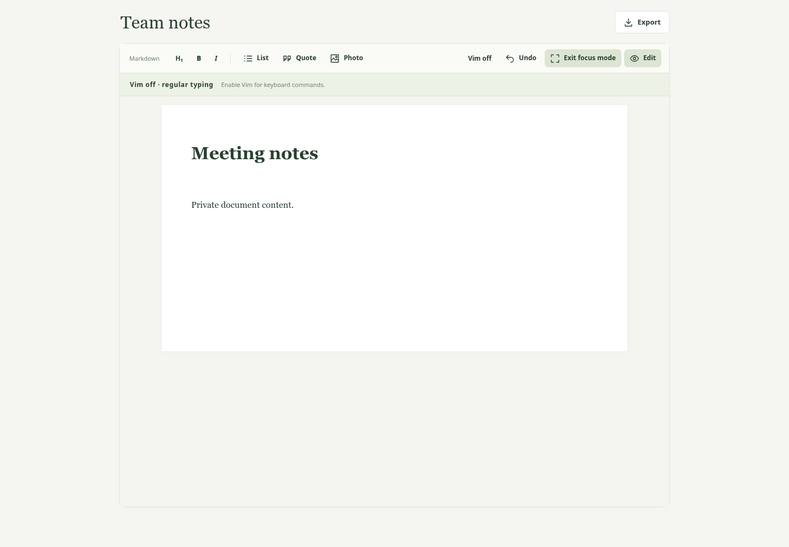
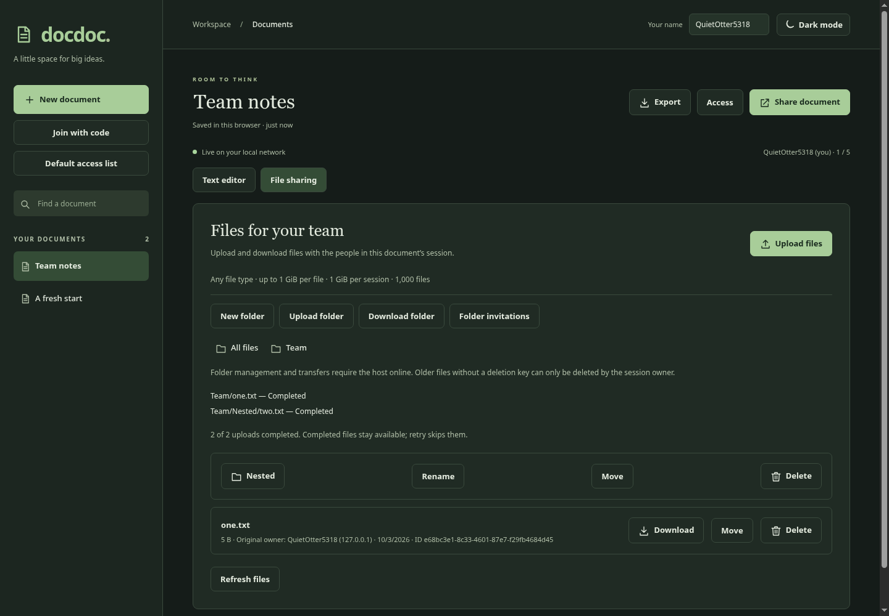
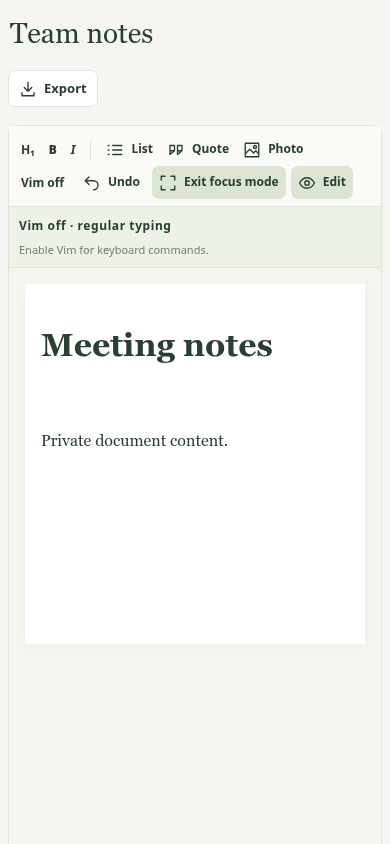
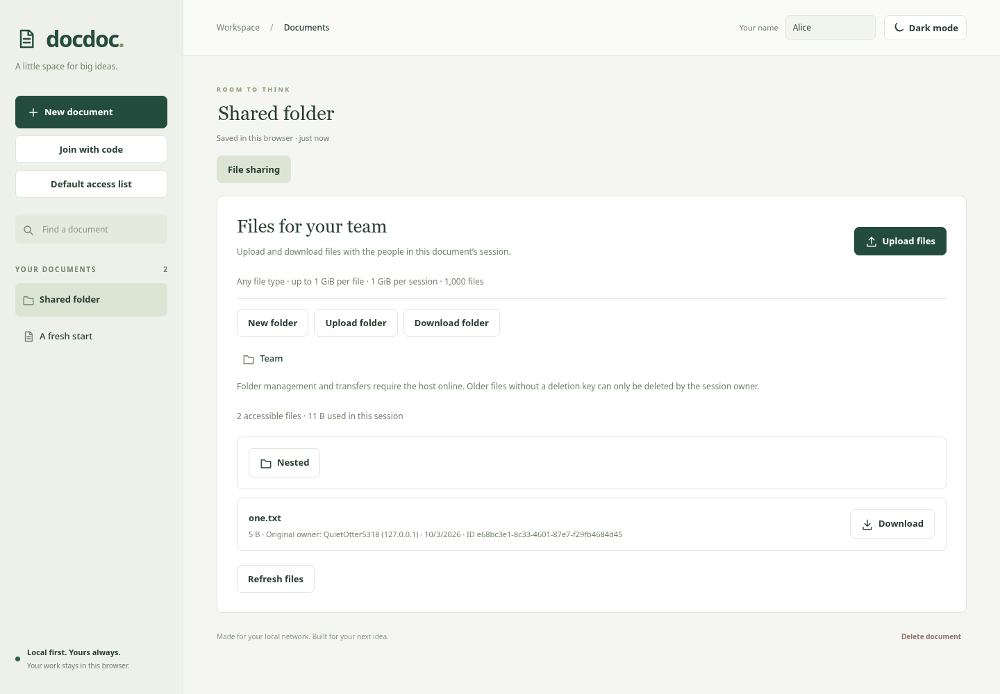

# DocDoc Offline

DocDoc Offline is a self-hosted, local-first workspace for writing Markdown documents and sharing files with people on the same local network. It is designed for teams that want a simple collaborative space without relying on a cloud account or internet connection for everyday editing.

Documents are saved in each browser and can be edited offline. When you share a document, a DocDoc host stores a durable copy and synchronizes changes with invited collaborators. A character-based CRDT merges concurrent edits and catches up after temporary disconnections. Each document supports up to **five active browser-profile identities**, including the owner. The workspace also includes Markdown preview, embedded photos, optional Vim-style editing, and a separate shared-files area with folders and scoped folder invitations.

DocDoc is currently a focused text-document MVP. It does not provide full Microsoft Word or Excel compatibility, spreadsheets, authenticated user accounts, or internet-scale cloud hosting. Invitations grant editing access; display names are labels rather than verified identities. See the [technical specification](docs/technical-specification.md) and [CRDT domain guide](docs/crdt-domain-guide.md) for the system model and collaboration details.

## Use cases

- **Draft together on a local network:** invite a small group to edit meeting notes, plans, procedures, or project documentation. Concurrent changes merge, and an interrupted connection can catch up later.
- **Keep working through an outage:** continue editing a document already open in the browser when the host or network is unavailable. Changes are saved locally and synchronize when the host returns.
- **Share a private team document:** distribute a short invitation code on a trusted LAN, optionally restrict the session with an IP, username, or detectable MAC address allowlist, and keep the shared copy on a self-hosted machine.
- **Collect and distribute project files:** use the document's separate file-sharing area for uploads, organized folders, streamed downloads, and ZIP folder downloads. Give guests access to one folder subtree without granting access to the document text.
- **Write and review lightweight Markdown:** use editing shortcuts, preview formatting, add embedded photos, then export a portable `.md` document.
- **Run a small self-hosted workspace:** keep room snapshots and shared-file bytes on a machine you control, back up its `data/` directory, and serve it to devices on the LAN.

These use cases assume collaborators can reach the same host. Offline editing works for browser-local documents; shared file bytes require the host to be available.

## Screenshots

| Focused document editing | Dark theme with shared folders |
| --- | --- |
|  |  |

| Mobile focus mode | Folder guest workspace |
| --- | --- |
|  |  |

## Run locally

Requires **Node.js 20 or newer**. There are no package dependencies or build step.

```sh
npm start
```

Open **http://localhost:3000**. For collaborators, open `http://<host-LAN-IP>:3000` on devices connected to the same network. The server binds to `0.0.0.0` by default. Set `PORT` and `HOST` to change its address:

```sh
PORT=8080 HOST=0.0.0.0 npm start
npm run dev   # Restart the server when source files change
npm test      # CRDT, access, transfers, and UI unit/integration tests
npm run check # JavaScript syntax checks
```

No dependency installation is needed: a fresh checkout is ready after installing Node.js. There is no generated build output; the host serves `public/` directly. `.editorconfig` records the existing two-space JavaScript conventions. `npm run check` checks every JavaScript source, script, and test.

For browser verification, install Chromium using your OS package manager, then run:

```sh
npm run test:browser
# If Chromium has a different executable path:
CHROMIUM=/path/to/chromium npm run test:browser
```

This opens an isolated headless browser and a temporary local server, exercises light/dark/mobile layouts and collaboration flows, and updates `docs/screenshots/`. It requires permission to bind a loopback port and launch Chromium. It never uses the host's `data/` or your browser profile.

## Run with Docker at boot (Linux)

The Docker package uses host networking to retain LAN connection IPs and MAC lookup behavior. Install Docker Engine and Docker Compose, then run these commands from the repository directory:

```sh
mkdir -p data
docker compose up -d --build
```

Open **http://localhost:3000** or `http://<host-LAN-IP>:3000`. Existing snapshots and shared files remain in `./data`, mounted into the container; back up this directory. The container runs as UID/GID 1000 by default. If the data directory belongs to a different user, start with `DOCDOC_UID=$(id -u) DOCDOC_GID=$(id -g) docker compose up -d --build`.

If Docker reports a bridge-network `veth` error, use this Compose configuration rather than starting the image with a plain `docker run`. Both the build and running container use host networking to avoid bridge interfaces. Recreate the service with `docker compose up -d --build --force-recreate`. For a manual launch, include `--network host`; port publishing (`-p`) is unnecessary with host networking.

Enable Docker's system service so the container returns after a reboot:

```sh
sudo systemctl enable --now docker
```

The `unless-stopped` restart policy starts the container when Docker starts, unless you deliberately stopped it. These commands manage the instance:

```sh
docker compose start         # Start an existing stopped instance
docker compose stop          # Stop it, including automatic boot startup
docker compose logs -f       # Follow application logs
docker compose ps            # View status and health
docker compose up -d --build # Rebuild and run after application changes
```

To use another port, run `DOCDOC_PORT=8080 docker compose up -d`. Use the same port override when recreating the container. Host networking makes the configured port available directly on the Linux host; choose an unused port. Docker's health check reports whether the application responds; the restart policy restarts exited processes rather than unhealthy containers.

Large transfers stream through `data/files/<session-id>/` on the bind mount. Allow at least 1 GiB of disk space per full session, plus snapshots and operational headroom. Run one DocDoc process per data directory so in-memory admission and upload reservations remain authoritative. Uploads have no fixed request-body timeout; keep reverse-proxy body limits at least **1,073,741,824 bytes**, disable request/response buffering for file routes, and allow enough transfer time for your LAN. ZIP downloads are streamed without a precomputed Content-Length. No extra Docker ports or dependencies are needed.

## Use the workspace

- Create and rename documents from the sidebar; search by title.
- Write Markdown with heading, bold, italic, list, quote, pipe tables, and triple-backtick fenced code blocks; toggle Preview to read the result. Tables support column alignment markers. Code blocks preserve whitespace, show an optional language label, and display unfinished fences through the end of the document.
- Changes autosave in this browser. Export a `.md` file for a portable backup, including embedded photos.
- Enter your display name and select **Share document** to show a QR code, short invitation link, and code, such as `xyz-jnk-dvc`. Scan the QR code or copy the link/code; use the host’s LAN address instead of localhost when inviting another device. QR generation is bundled with DocDoc and works without an external service.
- Open the invitation link, or select **Join with code** on the same LAN host and enter the code. Codes persist across host restarts; existing long invitation links still work.
- Joined documents open in **Preview**, including when reopened from the sidebar. Select **Edit** to write. Locally created documents start in editing mode.
- Press **F8** to switch between Edit and Preview. It works from the document editor and workspace controls while leaving browser shortcuts such as Print and Find available.
- Anyone with the document invitation link or code can edit unless an enabled session whitelist blocks their connection. Keep invitations within your intended group.
- The server rejects a sixth active user. Multiple tabs in one browser profile share a user identity and consume one place. Inactive places expire after 15 seconds; an upload in progress retains its place.
- If the host disappears, continue editing the already-open page. Changes merge automatically when it returns.

## Default access list

Select **Default access list** in the sidebar to save an optional template in this browser. It starts disabled and uses the same IP, username, and detectable-MAC matching rules as session Access. New local documents copy the current template at creation, including offline. Later template changes affect future documents only; existing and joined documents keep their policies. When a local document first creates a host session, the host validates and saves its inherited policy atomically with the initial document snapshot. There is no unrestricted interval before policy application.

Invalid entries show an error; failed template saves retain the previous stored settings. Existing documents without an inherited policy continue to create sessions with the whitelist disabled. The session owner retains the usual access override and can change individual sessions with **Access**.

## Session whitelists

Select **Access** beside Share document. Enable the whitelist, enter allowed IP addresses, usernames, or MAC addresses (one per line or comma-separated), then select **Save access settings**. An invitation remains required. A participant is allowed when **any** listed value matches; an enabled empty list permits only the owner. Disable the whitelist to restore normal invitation access.

- **IP:** exact IPv4 or IPv6 connection addresses, such as `192.168.1.20`. IPv4-mapped IPv6 addresses are normalized. Forwarding headers are ignored, so use direct LAN connections for per-device IP rules; a reverse proxy’s address identifies the proxy rather than the device.
- **Username:** case-insensitive match against the name entered in the app. Names are self-declared and are not authenticated accounts. For device restrictions, use IP or detectable MAC rules rather than relying on a username alone.
- **MAC:** match the Linux host’s detected IPv4 ARP entry, such as `aa:bb:cc:dd:ee:ff`. Browsers do not supply MAC addresses. This requires a device reachable on the host’s local IPv4 network and a complete ARP entry. Unknown MACs, devices behind routers/proxies, unsupported hosts, and IPv6-only connections cannot match MAC-only rules.

Settings persist on the host and apply to joining, editing, photo synchronization, and all file transfers. Removing access blocks future requests and releases matching active slots; it cannot erase copies someone already received. The Access dialog shows your connection address and connected participants’ addresses to the owner.

Only the session’s private **owner key** can change settings. New sessions save it in the creating browser and on the host; it is excluded from invitations and collaborator responses. The owner remains allowed but still counts toward the five-user limit.

For sessions created before this feature, or after losing browser storage, first access the session to initialize its owner key. On the LAN host, read `ownerToken` from the corresponding `data/<session-id>.json` file and paste it into Access’s owner-key field. The dialog identifies the file. Treat that key as private; recovered keys are saved only after validation. Back up the host’s session files to preserve settings and owner credentials.

New browser profiles receive a random default name such as `GuiltyPride0239`, saved for future visits. Change it using **Your name**. Existing custom names are preserved; the old default “You” is replaced on the next visit. Generated names are display labels, not unique or authenticated accounts.

## Appearance

The app follows your system’s light or dark theme by default, including the editor, file panel, dialogs, and native controls. Use the theme toggle at the top right to switch modes; your choice is saved in this browser and applies across reloads. The Markdown editor expands to display the entire document; long documents scroll with the page rather than inside the editor.

Select **Focus mode** in editing or preview to hide the sidebar and surrounding workspace while retaining the title, view switch, and essential controls. **Exit focus mode** or Escape returns to the workspace. Escape closes an open dialog first; switching documents or opening file sharing also exits focus. Browser chrome remains visible. Icons are bundled SVG symbols using the current text color and accessible button labels, including when labels change.

## Optional Vim bindings

Select **Vim** in the toolbar to enable the bindings. The preference is saved in this browser; regular typing is the default. A visible bar above the editor shows Normal, Insert, or Visual mode and a shortcut hint. The mode dropdown lets you switch without remembering shortcuts. Enabling Vim, restoring its saved preference, or opening another document starts in **Insert mode**, so you can type immediately. Press `Esc` for Normal mode, and `i` or choose Insert to resume typing. A solid, nonblinking caret marks the current position in all Vim modes while the editor is focused. It follows keyboard movement and wrapping; Visual mode also highlights the selection.

| Keys | Action |
| --- | --- |
| `i`, `a`, `I`, `A` | Insert at cursor, after cursor, at first nonblank character, or at line end |
| `Esc` | Return to Normal mode |
| `h j k l`, arrow keys | Move left, down, up, right |
| `w`, `b`, `0`, `^`, `$` | Next/previous word, line start, first nonblank, line end |
| `gg`, `G` | First/last line |
| `o`, `O` | Open a line below/above and enter Insert mode |
| `v` | Toggle Visual selection; `d`/`x` deletes and `y` yanks the selection |
| `x`, `dd`, `dw`, `d$` | Delete characters, lines, words, or to line end |
| `yy`, `p`, `u` | Yank line, paste internal register, undo local text edit |

Counts such as `3j`, `2dd`, and `3x` are supported. Tab and browser shortcuts remain available. This is a basic Vim layer, without Ex commands, macros, search, or the complete Vim command set.

## Photo uploads and preview

Select **Photo** to upload a PNG, JPEG, or WebP image at the editor cursor. Thumbnails appear beneath the editor; **Preview** shows images inline with the document. To remove a photo from the document, delete its `` text.

Uploads accept files up to 10 MB. Photos are resized to a maximum dimension of 1600 pixels and compressed to JPEG, at most 256 KB each; transparency is flattened onto white. Photos are saved with the document and synchronized to collaborators, with no external image hosting. They remain available offline along with the local copy.

Export replaces internal photo references with embedded data URLs. Use a Markdown viewer that supports embedded image data to display exported photos. Stored photo data remains in document history after removing its reference, and counts toward the existing 2 MB document sync limit. Adding a photo that would exceed the limit is rejected before changing the document.

## File-sharing mode

Select **File sharing** beside **Text editor**. Use **New folder**, **Upload files**, or **Upload folder** to start a shared session if needed. Breadcrumbs navigate nested folders. The session owner can rename and move folders, move files with the destination picker, and delete empty folders. Folder names must be unique within a parent; duplicate filenames are allowed and their IDs distinguish them.

Files have limits of **1 GiB (1,073,741,824 bytes) per file**, **1 GiB total per document session**, and **1,000 files per session**. Folders do not count as files; a separate 5,000-folder metadata cap applies. Uploads stream into temporary files and reserve capacity so concurrent requests cannot exceed limits. Folder uploads preserve relative paths and run sequentially after a size/count preflight. Progress shows completed, failed, and cancelled uploads. **Retry unfinished uploads** skips completed files and reuses private upload keys to avoid duplicates after a lost response. Keep the page open to retain its retry queue; closing it discards the queue. Folder selection exposes files and their relative paths; create empty folders explicitly with **New folder**.

Each file shows its original uploader's name and connection IP, preserved across restarts. Older uploads show “IP not recorded.” The session owner can delete any file after confirmation. The original uploading browser can delete new uploads using its private deletion credential, saved separately in local storage and never exposed by file listings. Clearing that storage loses uploader deletion rights; the owner can still delete. Legacy files without deletion credentials are owner-deletable only. Deleting immediately removes metadata and releases quota. If the filesystem refuses byte deletion, the host records cleanup work and retries when the room is loaded or files are requested.

**Download folder** streams a ZIP of the selected folder and its descendants, including empty folders. Duplicate filenames are disambiguated in ZIPs using file IDs. Downloads use short-lived, single-use tickets and the browser's download manager; the page does not allocate a file-sized Blob. Tickets expire after 60 seconds, disappear on host restart, and recheck current invitation scope and whitelist rules on redemption. Start the download again if a ticket expires or has already been used.

### Independent folder invitations

Open a folder as the session owner, then select **Folder invitations** to create or revoke short codes. Copy the code or link to a guest. Each code permits browsing, downloading, uploading, and subfolder creation within that folder and its descendants. Guests receive a **file-only workspace**: their credentials cannot read document content, document invitations, owner keys, sibling folders, or ancestor metadata. Owner-only rename/move/delete controls are hidden; an uploader can still delete their own uploads with the private key.

Folder guests obey the document whitelist and share the same five-user admission limit with document collaborators. Revocation blocks subsequent requests, including download tickets and uploads still being received. Moving a file outside a guest's scope also blocks later downloads. Already downloaded copies cannot be recalled. The owner can recover older owner keys through the existing **Access** workflow.

### Host data and compatibility

Back up **all of `data/`**, including JSON snapshots and `data/files/`, before updating the host. Existing document snapshots, CRDT migration, document invitations, and root-file endpoints remain compatible. Missing folder metadata defaults to an empty hierarchy; old files appear at the root without rewriting original uploader details. New snapshots additionally persist folder IDs/names/parent IDs, optional file folder IDs, private deletion hashes, folder invitations, and pending cleanup IDs. File bytes retain opaque UUID filenames; user-provided names are never disk paths.

Interrupted temporary uploads are cleaned on restart. Failed or cancelled uploads release their reservations; completed files remain if later files fail. File bytes and folder metadata require the LAN host online and are not included in browser document autosave, Markdown exports, or the service-worker cache. Core editing and saved default-access templates remain local-first.

### File API

All room routes require `Authorization: Bearer <document-or-folder-token>`. File and folder routes use `?user=<browser-id>&name=<display-name>`; owner actions also require `X-Owner-Key`. Document-only routes never accept folder credentials.

| Route | Behavior |
| --- | --- |
| `POST /api/rooms` | Accepts document `state` and optional validated `policy`, saved together |
| `GET /api/rooms/:id/files` | Scoped files/folders, quota totals, and limits; legacy files remain at root |
| `POST /api/rooms/:id/files?folder=<id>` | Raw streaming body, percent-encoded `X-File-Name`, optional 64-hex `X-Upload-Key`; returns private `deletionToken` only to uploader |
| `GET /api/rooms/:id/files/:file` | Compatible authenticated streaming download |
| `PATCH /api/rooms/:id/files/:file?folder=<id>` | Owner moves a file; empty folder parameter means root |
| `DELETE /api/rooms/:id/files/:file` | Owner or private `X-Deletion-Key` holder deletes a scoped file |
| `GET/POST /api/rooms/:id/folders` | Scoped inventory or `{action: create/rename/move/delete, name, id, parentId}` |
| `POST /api/rooms/:id/folder-invitations` | Owner `{action: create/list/revoke, folderId, code}` |
| `POST /api/invitations/join` | `{code, user, name}`; folder result has `kind: "folder"` and scoped credentials |
| `POST /api/rooms/:id/download-tickets` | `{user, name, fileId}` or `{user, name, folderId}`; returns a native download URL |
| `GET /api/downloads/:ticket` | Single-use streaming file or ZIP after current-access checks |

## Offline behavior and storage

Documents and invitation credentials are stored in browser local storage. Shared document snapshots also persist in the host’s `data/` directory. Clearing browser storage removes local copies and resets that browser’s identity; keep exports and back up the host’s data directory.

A service worker caches the application after the first visit on **localhost or HTTPS**. For offline page reloads on other LAN devices, serve the app over HTTPS using a trusted certificate and a same-origin reverse proxy. Plain HTTP LAN access supports collaboration and editing in an already-open page, but does not support offline reloads. Local copies belong to the browser origin, so switching between localhost and a LAN address uses separate storage.

## Architecture and project structure

- `public/`: responsive browser UI, editor, optional Vim bindings, photo processing and preview, character CRDT, bundled QR generator, and offline cache worker.
- `src/server.js`: Node HTTP server, invitation checks, participant admission, synchronization, and atomic snapshot persistence.
- `public/policy.js` and `src/access-control.js`: shared policy validation, peer-address matching, and Linux ARP-based MAC detection.
- `src/file-sharing.js`, `src/folders.js`, and `src/zip.js`: streaming transfers, quota reservations, deletion, hierarchy checks, and ZIP generation.
- `public/icons.svg`: bundled icon assets; `public/qrcode-generator.mjs` and its MIT license: local QR generation; `public/focus.js` and `public/defaults.js`: focused views and browser access templates.
- `scripts/`: syntax checks and isolated Chromium smoke verification; `docs/screenshots/`: UI validation artifacts.
- `tests/`: concurrent-edit convergence, duplicate/reordered delivery, authorization, five-user capacity, reconnection, and restart persistence checks. Server tests invoke the real request listener without opening TCP sockets.
- `docs/application-plan.md`: product scope and delivery plan.
- `docs/technical-specification.md`: implemented architecture, domain model, protocol, trust boundaries, persistence, and operational limits.
- `docs/crdt-domain-guide.md`: CRDT concepts explained against DocDoc's concrete sequence, title, image, merge, and sync behavior.

The CRDT merges immutable character insertions and deletion tombstones; document titles use Lamport timestamps. Clients exchange complete state every two seconds. The server checks invitations and available places before merging or returning content. A browser profile has one user identity; each tab has a separate editing actor.

## Current scope

This is a text-document MVP with basic Markdown formatting, not full Word or Excel compatibility. Preview renders headings, emphasis, lists, quotes, pipe tables, local photos, and escaped fenced code blocks; syntax highlighting is not included. Spreadsheets, view-only permissions, document-invitation revocation, host migration, and authenticated accounts are future work. Invitation links and short codes act as edit credentials; identities are browser-generated rather than authenticated accounts. The host enforces five distinct presented user identities, not verified people.

Synchronization accepts up to 2 MB of serialized CRDT state, including edit history. This version is intended for small documents; export a backup if storage or sync limits are reached. Undo reverses local text edits; it does not provide a full document revision history. Markdown preview supports a small formatting subset and uploaded raster photos; it does not render arbitrary HTML or fetch external Markdown images.
